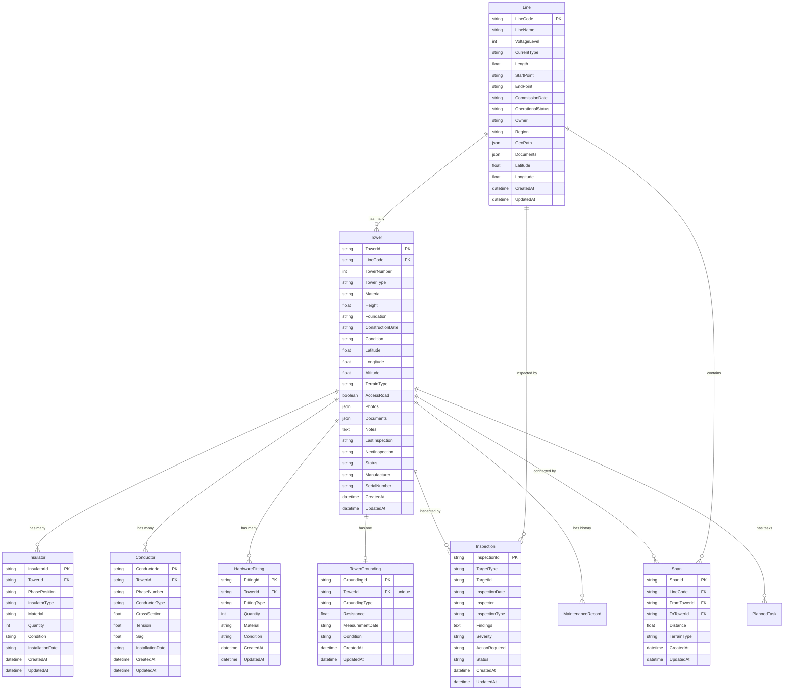

# طراحی فنی: گسترش موجودیت‌های خطوط انتقال برق

## Overview

این سند طراحی فنی برای افزودن 8 موجودیت جدید به سیستم مدیریت خطوط انتقال برق است. موجودیت‌های جدید شامل Line، Tower، Insulator، Conductor، HardwareFitting، TowerGrounding، Span و Inspection هستند که امکان مدیریت جامع و دقیق‌تر اطلاعات خطوط انتقال برق را فراهم می‌کنند.

### هدف طراحی

گسترش ساختار داده موجود برای پشتیبانی از:
- مدیریت کامل اطلاعات خطوط انتقال و دکل‌ها با جزئیات فنی بیشتر
- ثبت اطلاعات تجهیزات و قطعات دکل‌ها (مقره، هادی، یراق‌آلات، سیستم ارت)
- مدیریت دهانه‌های بین دکل‌ها و تحلیل هندسی خطوط
- سیستم بازرسی جامع برای خطوط و دکل‌ها
- حفظ یکپارچگی داده‌ها و اعتبارسنجی روابط بین موجودیت‌ها
- پشتیبانی از مهاجرت داده‌های موجود به ساختار جدید

### محدوده طراحی

این طراحی شامل:
- ✅ مدل‌های SQLAlchemy برای 8 موجودیت جدید
- ✅ Pydantic schemas برای validation و serialization
- ✅ API endpoints با FastAPI برای عملیات CRUD
- ✅ Foreign key constraints و cascade deletes
- ✅ Business logic validation
- ✅ اسکریپت مهاجرت داده

این طراحی شامل موارد زیر نمی‌شود:
- ❌ تغییرات UI و frontend (خارج از محدوده این spec)
- ❌ تغییرات authentication و authorization
- ❌ تغییرات در موجودیت‌های موجود PowerLineRecord و User


## Architecture

### معماری کلی سیستم

سیستم از معماری 3-tier استفاده می‌کند:

```
┌─────────────────────────────────────────┐
│         Frontend (React + Vite)         │
│    UI Components, State Management      │
└─────────────────────────────────────────┘
                    │
                    │ HTTP/REST
                    ▼
┌─────────────────────────────────────────┐
│       Backend (FastAPI + Python)        │
│  ┌───────────────────────────────────┐  │
│  │      Routers (API Endpoints)      │  │
│  └───────────────────────────────────┘  │
│  ┌───────────────────────────────────┐  │
│  │    Business Logic & Validation    │  │
│  └───────────────────────────────────┘  │
│  ┌───────────────────────────────────┐  │
│  │    Models (SQLAlchemy ORM)        │  │
│  └───────────────────────────────────┘  │
└─────────────────────────────────────────┘
                    │
                    │ SQLAlchemy
                    ▼
┌─────────────────────────────────────────┐
│        Database (SQLite)                │
│    Tables, Relationships, Constraints   │
└─────────────────────────────────────────┘
```

### پترن‌های معماری

1. **ORM Pattern**: استفاده از SQLAlchemy برای mapping بین objects و tables
2. **Repository Pattern**: دسترسی به داده از طریق Session objects
3. **DTO Pattern**: استفاده از Pydantic schemas برای data transfer
4. **Dependency Injection**: استفاده از FastAPI Depends برای database sessions
5. **Layered Architecture**: جداسازی واضح بین API, Business Logic و Data Access


### دیاگرام روابط موجودیت‌ها (ERD)




## Components and Interfaces

### 1. Database Models (SQLAlchemy)

#### 1.1 Line Model (توسعه مدل موجود)

مدل Line موجود را با فیلدهای جدید گسترش می‌دهیم:

```python
class Line(Base):
    __tablename__ = "lines"
    
    # Existing fields
    id = Column(String, primary_key=True)  # LineCode
    name = Column(String, nullable=False)  # LineName
    voltage = Column(Integer, default=0)   # VoltageLevel
    status = Column(String, default="active")  # OperationalStatus
    color_class = Column(String, default="c1")
    color_hex = Column(String, default="#3b82f6")
    
    # New fields
    current_type = Column(String, nullable=True)  # AC or DC
    length = Column(Float, nullable=True)
    start_point = Column(String, nullable=True)
    end_point = Column(String, nullable=True)
    commission_date = Column(String, nullable=True)  # Jalali date
    owner = Column(String, nullable=True)
    region = Column(String, nullable=True)
    geo_path = Column(Text, nullable=True)  # JSON string
    documents = Column(Text, nullable=True)  # JSON string
    latitude = Column(Float, nullable=True)
    longitude = Column(Float, nullable=True)
    created_at = Column(DateTime, default=datetime.utcnow)
    updated_at = Column(DateTime, default=datetime.utcnow, onupdate=datetime.utcnow)
    
    # Relationships
    towers = relationship("Tower", back_populates="line", cascade="all, delete-orphan")
    spans = relationship("Span", back_populates="line", cascade="all, delete-orphan")
    inspections = relationship("Inspection", 
                              primaryjoin="and_(Inspection.target_type=='Line', "
                                         "foreign(Inspection.target_id)==Line.id)",
                              viewonly=True)
```


#### 1.2 Tower Model (توسعه مدل موجود)

مدل Tower موجود را با فیلدهای جدید گسترش می‌دهیم:

```python
class Tower(Base):
    __tablename__ = "towers"
    
    # Existing fields
    id = Column(String, primary_key=True)  # TowerId: "line_id||number"
    line_id = Column(String, ForeignKey("lines.id", ondelete="CASCADE"), nullable=False)
    number = Column(Integer, nullable=False)
    x = Column(Float, default=0)
    y = Column(Float, default=0)
    type = Column(String, default="معلق")  # TowerType
    height = Column(Float, default=40)
    last_maintenance = Column(String)  # LastInspection
    next_maintenance = Column(String)  # NextInspection
    
    # New fields
    material = Column(String, nullable=True)
    foundation = Column(String, nullable=True)
    construction_date = Column(String, nullable=True)  # Jalali date
    condition = Column(String, nullable=True)
    latitude = Column(Float, nullable=True)
    longitude = Column(Float, nullable=True)
    altitude = Column(Float, nullable=True)
    terrain_type = Column(String, nullable=True)
    access_road = Column(Boolean, default=False)
    photos = Column(Text, nullable=True)  # JSON string
    documents = Column(Text, nullable=True)  # JSON string
    notes = Column(Text, nullable=True)
    status = Column(String, default="active")
    manufacturer = Column(String, nullable=True)
    serial_number = Column(String, nullable=True)
    created_at = Column(DateTime, default=datetime.utcnow)
    updated_at = Column(DateTime, default=datetime.utcnow, onupdate=datetime.utcnow)
    
    # Relationships
    line = relationship("Line", back_populates="towers")
    maintenance_records = relationship("MaintenanceRecord", back_populates="tower", 
                                      cascade="all, delete-orphan")
    planned_tasks = relationship("PlannedTask", back_populates="tower",
                                cascade="all, delete-orphan")
    insulators = relationship("Insulator", back_populates="tower",
                            cascade="all, delete-orphan")
    conductors = relationship("Conductor", back_populates="tower",
                            cascade="all, delete-orphan")
    hardware_fittings = relationship("HardwareFitting", back_populates="tower",
                                    cascade="all, delete-orphan")
    tower_grounding = relationship("TowerGrounding", back_populates="tower",
                                  uselist=False, cascade="all, delete-orphan")
    spans_from = relationship("Span", foreign_keys="Span.from_tower_id",
                            cascade="all, delete-orphan")
    spans_to = relationship("Span", foreign_keys="Span.to_tower_id",
                          cascade="all, delete-orphan")
    inspections = relationship("Inspection",
                             primaryjoin="and_(Inspection.target_type=='Tower', "
                                        "foreign(Inspection.target_id)==Tower.id)",
                             viewonly=True)
    
    __table_args__ = (
        UniqueConstraint('line_id', 'number', name='uq_tower_line_number'),
    )
```


#### 1.3 Insulator Model (موجودیت جدید)

```python
class Insulator(Base):
    __tablename__ = "insulators"
    
    id = Column(String, primary_key=True, default=lambda: 'ins_' + str(uuid4())[:8])
    tower_id = Column(String, ForeignKey("towers.id", ondelete="CASCADE"), nullable=False)
    phase_position = Column(String, nullable=True)  # Phase_A, Phase_B, Phase_C, Ground
    insulator_type = Column(String, nullable=True)
    material = Column(String, nullable=True)
    quantity = Column(Integer, nullable=True)
    condition = Column(String, nullable=True)  # Good, Fair, Poor, Critical
    installation_date = Column(String, nullable=True)  # Jalali date
    created_at = Column(DateTime, default=datetime.utcnow)
    updated_at = Column(DateTime, default=datetime.utcnow, onupdate=datetime.utcnow)
    
    # Relationships
    tower = relationship("Tower", back_populates="insulators")
```

#### 1.4 Conductor Model (موجودیت جدید)

```python
class Conductor(Base):
    __tablename__ = "conductors"
    
    id = Column(String, primary_key=True, default=lambda: 'cnd_' + str(uuid4())[:8])
    tower_id = Column(String, ForeignKey("towers.id", ondelete="CASCADE"), nullable=False)
    phase_number = Column(String, nullable=True)  # Phase_1, Phase_2, Phase_3, Ground_Wire
    conductor_type = Column(String, nullable=True)
    cross_section = Column(Float, nullable=True)
    tension = Column(Float, nullable=True)
    sag = Column(Float, nullable=True)
    installation_date = Column(String, nullable=True)  # Jalali date
    created_at = Column(DateTime, default=datetime.utcnow)
    updated_at = Column(DateTime, default=datetime.utcnow, onupdate=datetime.utcnow)
    
    # Relationships
    tower = relationship("Tower", back_populates="conductors")
```

#### 1.5 HardwareFitting Model (موجودیت جدید)

```python
class HardwareFitting(Base):
    __tablename__ = "hardware_fittings"
    
    id = Column(String, primary_key=True, default=lambda: 'hwf_' + str(uuid4())[:8])
    tower_id = Column(String, ForeignKey("towers.id", ondelete="CASCADE"), nullable=False)
    fitting_type = Column(String, nullable=True)  # Clamp, Shackle, Damper, Spacer, Connector, Other
    quantity = Column(Integer, nullable=True)
    material = Column(String, nullable=True)
    condition = Column(String, nullable=True)  # Good, Fair, Poor, Critical
    created_at = Column(DateTime, default=datetime.utcnow)
    updated_at = Column(DateTime, default=datetime.utcnow, onupdate=datetime.utcnow)
    
    # Relationships
    tower = relationship("Tower", back_populates="hardware_fittings")
```


#### 1.6 TowerGrounding Model (موجودیت جدید)

```python
class TowerGrounding(Base):
    __tablename__ = "tower_grounding"
    
    id = Column(String, primary_key=True, default=lambda: 'gnd_' + str(uuid4())[:8])
    tower_id = Column(String, ForeignKey("towers.id", ondelete="CASCADE"), 
                     nullable=False, unique=True)  # One-to-one relationship
    grounding_type = Column(String, nullable=True)  # Rod, Grid, Plate, Chemical
    resistance = Column(Float, nullable=True)
    measurement_date = Column(String, nullable=True)  # Jalali date
    condition = Column(String, nullable=True)
    created_at = Column(DateTime, default=datetime.utcnow)
    updated_at = Column(DateTime, default=datetime.utcnow, onupdate=datetime.utcnow)
    
    # Relationships
    tower = relationship("Tower", back_populates="tower_grounding")
```

#### 1.7 Span Model (موجودیت جدید)

```python
class Span(Base):
    __tablename__ = "spans"
    
    id = Column(String, primary_key=True, default=lambda: 'spn_' + str(uuid4())[:8])
    line_code = Column(String, ForeignKey("lines.id", ondelete="CASCADE"), nullable=False)
    from_tower_id = Column(String, ForeignKey("towers.id", ondelete="CASCADE"), nullable=False)
    to_tower_id = Column(String, ForeignKey("towers.id", ondelete="CASCADE"), nullable=False)
    distance = Column(Float, nullable=True)
    terrain_type = Column(String, nullable=True)  # Flat, Rolling, Hilly, Mountainous, River_Crossing, Urban
    created_at = Column(DateTime, default=datetime.utcnow)
    updated_at = Column(DateTime, default=datetime.utcnow, onupdate=datetime.utcnow)
    
    # Relationships
    line = relationship("Line", back_populates="spans")
    from_tower = relationship("Tower", foreign_keys=[from_tower_id], back_populates="spans_from")
    to_tower = relationship("Tower", foreign_keys=[to_tower_id], back_populates="spans_to")
```

#### 1.8 Inspection Model (موجودیت جدید)

```python
class Inspection(Base):
    __tablename__ = "inspections"
    
    id = Column(String, primary_key=True, default=lambda: 'isp_' + str(uuid4())[:8])
    target_type = Column(String, nullable=False)  # Line or Tower
    target_id = Column(String, nullable=False)  # Foreign key to Line.id or Tower.id
    inspection_date = Column(String, nullable=True)  # Jalali date
    inspector = Column(String, nullable=True)
    inspection_type = Column(String, nullable=True)  # Routine, Emergency, Post_Storm, Annual
    findings = Column(Text, nullable=True)
    severity = Column(String, nullable=True)  # Low, Medium, High, Critical
    action_required = Column(String, nullable=True)
    status = Column(String, nullable=True)
    created_at = Column(DateTime, default=datetime.utcnow)
    updated_at = Column(DateTime, default=datetime.utcnow, onupdate=datetime.utcnow)
    
    # Note: Polymorphic relationships are handled via viewonly relationships in Line and Tower
```


### 2. Pydantic Schemas

#### 2.1 Line Schemas (توسعه schemas موجود)

```python
from pydantic import BaseModel, Field, field_validator
from typing import Optional
from datetime import datetime

class LineBase(BaseModel):
    name: str = Field(..., min_length=1)
    voltage: int = Field(..., ge=0)
    current_type: Optional[str] = None
    length: Optional[float] = Field(None, ge=0)
    start_point: Optional[str] = None
    end_point: Optional[str] = None
    commission_date: Optional[str] = None
    status: str = "active"
    owner: Optional[str] = None
    region: Optional[str] = None
    geo_path: Optional[str] = None  # JSON string
    documents: Optional[str] = None  # JSON string
    latitude: Optional[float] = Field(None, ge=-90, le=90)
    longitude: Optional[float] = Field(None, ge=-180, le=180)
    color_class: str = "c1"
    color_hex: str = "#3b82f6"
    
    @field_validator('voltage')
    @classmethod
    def validate_voltage(cls, v):
        if v not in [132, 230, 400, 765]:
            raise ValueError('VoltageLevel must be 132, 230, 400, or 765')
        return v
    
    @field_validator('current_type')
    @classmethod
    def validate_current_type(cls, v):
        if v is not None and v not in ['AC', 'DC']:
            raise ValueError('CurrentType must be AC or DC')
        return v

class LineCreate(LineBase):
    id: str  # LineCode

class LineUpdate(LineBase):
    pass

class LineResponse(LineBase):
    id: str
    created_at: datetime
    updated_at: datetime
    
    model_config = {"from_attributes": True}
```


#### 2.2 Tower Schemas (توسعه schemas موجود)

```python
class TowerBase(BaseModel):
    line_id: str
    number: int = Field(..., gt=0)
    type: str = "معلق"
    material: Optional[str] = None
    height: Optional[float] = Field(None, gt=0)
    foundation: Optional[str] = None
    construction_date: Optional[str] = None
    condition: Optional[str] = None
    latitude: Optional[float] = Field(None, ge=-90, le=90)
    longitude: Optional[float] = Field(None, ge=-180, le=180)
    altitude: Optional[float] = None
    terrain_type: Optional[str] = None
    access_road: bool = False
    photos: Optional[str] = None  # JSON string
    documents: Optional[str] = None  # JSON string
    notes: Optional[str] = None
    status: str = "active"
    manufacturer: Optional[str] = None
    serial_number: Optional[str] = None
    x: float = 0
    y: float = 0

class TowerCreate(TowerBase):
    pass

class TowerUpdate(TowerBase):
    pass

class TowerResponse(TowerBase):
    id: str  # TowerId
    last_maintenance: Optional[str] = None
    next_maintenance: Optional[str] = None
    created_at: datetime
    updated_at: datetime
    
    model_config = {"from_attributes": True}
```

#### 2.3 Insulator Schemas

```python
class InsulatorBase(BaseModel):
    tower_id: str
    phase_position: Optional[str] = None
    insulator_type: Optional[str] = None
    material: Optional[str] = None
    quantity: Optional[int] = Field(None, gt=0)
    condition: Optional[str] = None
    installation_date: Optional[str] = None
    
    @field_validator('phase_position')
    @classmethod
    def validate_phase_position(cls, v):
        if v is not None and v not in ['Phase_A', 'Phase_B', 'Phase_C', 'Ground']:
            raise ValueError('PhasePosition must be Phase_A, Phase_B, Phase_C, or Ground')
        return v
    
    @field_validator('condition')
    @classmethod
    def validate_condition(cls, v):
        if v is not None and v not in ['Good', 'Fair', 'Poor', 'Critical']:
            raise ValueError('Condition must be Good, Fair, Poor, or Critical')
        return v

class InsulatorCreate(InsulatorBase):
    pass

class InsulatorUpdate(InsulatorBase):
    pass

class InsulatorResponse(InsulatorBase):
    id: str
    created_at: datetime
    updated_at: datetime
    
    model_config = {"from_attributes": True}
```


#### 2.4 Conductor Schemas

```python
class ConductorBase(BaseModel):
    tower_id: str
    phase_number: Optional[str] = None
    conductor_type: Optional[str] = None
    cross_section: Optional[float] = Field(None, gt=0)
    tension: Optional[float] = Field(None, gt=0)
    sag: Optional[float] = Field(None, ge=0)
    installation_date: Optional[str] = None
    
    @field_validator('phase_number')
    @classmethod
    def validate_phase_number(cls, v):
        if v is not None and v not in ['Phase_1', 'Phase_2', 'Phase_3', 'Ground_Wire']:
            raise ValueError('PhaseNumber must be Phase_1, Phase_2, Phase_3, or Ground_Wire')
        return v

class ConductorCreate(ConductorBase):
    pass

class ConductorUpdate(ConductorBase):
    pass

class ConductorResponse(ConductorBase):
    id: str
    created_at: datetime
    updated_at: datetime
    
    model_config = {"from_attributes": True}
```

#### 2.5 HardwareFitting Schemas

```python
class HardwareFittingBase(BaseModel):
    tower_id: str
    fitting_type: Optional[str] = None
    quantity: Optional[int] = Field(None, gt=0)
    material: Optional[str] = None
    condition: Optional[str] = None
    
    @field_validator('fitting_type')
    @classmethod
    def validate_fitting_type(cls, v):
        if v is not None and v not in ['Clamp', 'Shackle', 'Damper', 'Spacer', 'Connector', 'Other']:
            raise ValueError('FittingType must be Clamp, Shackle, Damper, Spacer, Connector, or Other')
        return v
    
    @field_validator('condition')
    @classmethod
    def validate_condition(cls, v):
        if v is not None and v not in ['Good', 'Fair', 'Poor', 'Critical']:
            raise ValueError('Condition must be Good, Fair, Poor, or Critical')
        return v

class HardwareFittingCreate(HardwareFittingBase):
    pass

class HardwareFittingUpdate(HardwareFittingBase):
    pass

class HardwareFittingResponse(HardwareFittingBase):
    id: str
    created_at: datetime
    updated_at: datetime
    
    model_config = {"from_attributes": True}

class HardwareFittingBulkCreate(BaseModel):
    fittings: list[HardwareFittingCreate]
```


#### 2.6 TowerGrounding Schemas

```python
class TowerGroundingBase(BaseModel):
    tower_id: str
    grounding_type: Optional[str] = None
    resistance: Optional[float] = Field(None, gt=0)
    measurement_date: Optional[str] = None
    condition: Optional[str] = None
    
    @field_validator('grounding_type')
    @classmethod
    def validate_grounding_type(cls, v):
        if v is not None and v not in ['Rod', 'Grid', 'Plate', 'Chemical']:
            raise ValueError('GroundingType must be Rod, Grid, Plate, or Chemical')
        return v

class TowerGroundingCreate(TowerGroundingBase):
    pass

class TowerGroundingUpdate(TowerGroundingBase):
    pass

class TowerGroundingResponse(TowerGroundingBase):
    id: str
    created_at: datetime
    updated_at: datetime
    needs_attention: bool  # Computed field: resistance > 5
    
    model_config = {"from_attributes": True}
```

#### 2.7 Span Schemas

```python
class SpanBase(BaseModel):
    line_code: str
    from_tower_id: str
    to_tower_id: str
    distance: Optional[float] = Field(None, gt=0)
    terrain_type: Optional[str] = None
    
    @field_validator('terrain_type')
    @classmethod
    def validate_terrain_type(cls, v):
        if v is not None and v not in ['Flat', 'Rolling', 'Hilly', 'Mountainous', 'River_Crossing', 'Urban']:
            raise ValueError('TerrainType must be Flat, Rolling, Hilly, Mountainous, River_Crossing, or Urban')
        return v

class SpanCreate(SpanBase):
    pass

class SpanUpdate(SpanBase):
    pass

class SpanResponse(SpanBase):
    id: str
    created_at: datetime
    updated_at: datetime
    
    model_config = {"from_attributes": True}
```


#### 2.8 Inspection Schemas

```python
class InspectionBase(BaseModel):
    target_type: str
    target_id: str
    inspection_date: Optional[str] = None
    inspector: Optional[str] = None
    inspection_type: Optional[str] = None
    findings: Optional[str] = None
    severity: Optional[str] = None
    action_required: Optional[str] = None
    status: Optional[str] = None
    
    @field_validator('target_type')
    @classmethod
    def validate_target_type(cls, v):
        if v not in ['Line', 'Tower']:
            raise ValueError('TargetType must be Line or Tower')
        return v
    
    @field_validator('severity')
    @classmethod
    def validate_severity(cls, v):
        if v is not None and v not in ['Low', 'Medium', 'High', 'Critical']:
            raise ValueError('Severity must be Low, Medium, High, or Critical')
        return v
    
    @field_validator('inspection_type')
    @classmethod
    def validate_inspection_type(cls, v):
        if v is not None and v not in ['Routine', 'Emergency', 'Post_Storm', 'Annual']:
            raise ValueError('InspectionType must be Routine, Emergency, Post_Storm, or Annual')
        return v

class InspectionCreate(InspectionBase):
    pass

class InspectionUpdate(InspectionBase):
    pass

class InspectionResponse(InspectionBase):
    id: str
    created_at: datetime
    updated_at: datetime
    
    model_config = {"from_attributes": True}
```


### 3. API Endpoints

#### 3.1 Endpoint Structure

تمام endpoints با پیشوند `/api/entities` شروع می‌شوند و از الگوی RESTful استفاده می‌کنند:

```
POST   /api/entities/{entity}           # Create
GET    /api/entities/{entity}/{id}      # Read single
GET    /api/entities/{entity}           # Read list (with pagination & filters)
PUT    /api/entities/{entity}/{id}      # Update
DELETE /api/entities/{entity}/{id}      # Delete
```

#### 3.2 Lines Endpoints (توسعه موجود)

```python
# Update existing lines endpoints
@router.put("/api/entities/lines/{line_id}", response_model=LineResponse)
def update_line(
    line_id: str,
    line: LineUpdate,
    db: Session = Depends(get_db),
    current_user: User = Depends(get_current_admin_user),
):
    db_line = db.query(Line).filter(Line.id == line_id).first()
    if not db_line:
        raise HTTPException(status_code=404, detail="Line not found")
    
    for field, value in line.model_dump(exclude_unset=True).items():
        setattr(db_line, field, value)
    
    db.commit()
    db.refresh(db_line)
    return db_line

@router.delete("/api/entities/lines/{line_id}")
def delete_line(
    line_id: str,
    db: Session = Depends(get_db),
    current_user: User = Depends(get_current_admin_user),
):
    db_line = db.query(Line).filter(Line.id == line_id).first()
    if not db_line:
        raise HTTPException(status_code=404, detail="Line not found")
    
    # Check if line has towers
    tower_count = db.query(Tower).filter(Tower.line_id == line_id).count()
    if tower_count > 0:
        raise HTTPException(
            status_code=400, 
            detail=f"Cannot delete line with {tower_count} associated towers"
        )
    
    db.delete(db_line)
    db.commit()
    return {"message": "Line deleted successfully"}
```


#### 3.3 Towers Endpoints (توسعه موجود)

```python
@router.put("/api/entities/towers/{tower_id}", response_model=TowerResponse)
def update_tower(
    tower_id: str,
    tower: TowerUpdate,
    db: Session = Depends(get_db),
    current_user: User = Depends(get_current_admin_user),
):
    db_tower = db.query(Tower).filter(Tower.id == tower_id).first()
    if not db_tower:
        raise HTTPException(status_code=404, detail="Tower not found")
    
    for field, value in tower.model_dump(exclude_unset=True).items():
        setattr(db_tower, field, value)
    
    db.commit()
    db.refresh(db_tower)
    return db_tower

@router.delete("/api/entities/towers/{tower_id}")
def delete_tower(
    tower_id: str,
    db: Session = Depends(get_db),
    current_user: User = Depends(get_current_admin_user),
):
    db_tower = db.query(Tower).filter(Tower.id == tower_id).first()
    if not db_tower:
        raise HTTPException(status_code=404, detail="Tower not found")
    
    # Cascade delete will handle: insulators, conductors, hardware_fittings, 
    # tower_grounding, spans, maintenance_records, planned_tasks
    
    # Mark inspections as orphaned
    db.query(Inspection).filter(
        Inspection.target_type == "Tower",
        Inspection.target_id == tower_id
    ).update({"status": "orphaned"})
    
    db.delete(db_tower)
    db.commit()
    return {"message": "Tower deleted successfully"}
```

#### 3.4 Generic CRUD for New Entities

برای موجودیت‌های جدید (Insulator, Conductor, HardwareFitting, TowerGrounding, Span, Inspection) از یک الگوی generic استفاده می‌کنیم:

```python
from typing import TypeVar, Generic, Type
from pydantic import BaseModel
from sqlalchemy.orm import Session

T = TypeVar('T')
CreateSchema = TypeVar('CreateSchema', bound=BaseModel)
UpdateSchema = TypeVar('UpdateSchema', bound=BaseModel)
ResponseSchema = TypeVar('ResponseSchema', bound=BaseModel)

def create_crud_endpoints(
    router: APIRouter,
    entity_name: str,
    model_class: Type[T],
    create_schema: Type[CreateSchema],
    update_schema: Type[UpdateSchema],
    response_schema: Type[ResponseSchema],
    requires_admin: bool = False
):
    auth_dependency = get_current_admin_user if requires_admin else get_current_user
    
    @router.post(f"/api/entities/{entity_name}", response_model=response_schema)
    def create_entity(
        entity: create_schema,
        db: Session = Depends(get_db),
        current_user: User = Depends(auth_dependency),
    ):
        db_entity = model_class(**entity.model_dump())
        db.add(db_entity)
        db.commit()
        db.refresh(db_entity)
        return db_entity
    
    @router.get(f"/api/entities/{entity_name}/{{entity_id}}", response_model=response_schema)
    def get_entity(
        entity_id: str,
        db: Session = Depends(get_db),
        current_user: User = Depends(get_current_user),
    ):
        db_entity = db.query(model_class).filter(model_class.id == entity_id).first()
        if not db_entity:
            raise HTTPException(status_code=404, detail=f"{entity_name} not found")
        return db_entity
    
    # Continue with PUT, DELETE, and LIST endpoints...
```


#### 3.5 Special Endpoints

```python
# Bulk create hardware fittings
@router.post("/api/entities/hardware-fittings/bulk", response_model=list[HardwareFittingResponse])
def bulk_create_hardware_fittings(
    bulk_data: HardwareFittingBulkCreate,
    db: Session = Depends(get_db),
    current_user: User = Depends(get_current_user),
):
    created_fittings = []
    for fitting_data in bulk_data.fittings:
        db_fitting = HardwareFitting(**fitting_data.model_dump())
        db.add(db_fitting)
        created_fittings.append(db_fitting)
    
    db.commit()
    for fitting in created_fittings:
        db.refresh(fitting)
    
    return created_fittings

# Get insulators grouped by phase position for a tower
@router.get("/api/entities/insulators/tower/{tower_id}/grouped")
def get_insulators_grouped(
    tower_id: str,
    db: Session = Depends(get_db),
    current_user: User = Depends(get_current_user),
):
    insulators = db.query(Insulator).filter(Insulator.tower_id == tower_id).all()
    grouped = {}
    for ins in insulators:
        phase = ins.phase_position or "Unknown"
        if phase not in grouped:
            grouped[phase] = []
        grouped[phase].append(InsulatorResponse.model_validate(ins))
    return grouped

# Get all spans for a line ordered by from_tower
@router.get("/api/entities/spans/line/{line_code}/ordered")
def get_spans_ordered(
    line_code: str,
    db: Session = Depends(get_db),
    current_user: User = Depends(get_current_user),
):
    spans = db.query(Span).filter(Span.line_code == line_code).join(
        Tower, Span.from_tower_id == Tower.id
    ).order_by(Tower.number).all()
    return [SpanResponse.model_validate(span) for span in spans]

# Get inspection report (lines/towers requiring inspection)
@router.get("/api/entities/inspections/report")
def get_inspection_report(
    db: Session = Depends(get_db),
    current_user: User = Depends(get_current_user),
):
    from datetime import datetime, timedelta
    from dateutil.relativedelta import relativedelta
    
    two_years_ago = datetime.now() - relativedelta(years=2)
    
    # Lines requiring inspection
    lines_needing_inspection = []
    for line in db.query(Line).all():
        last_inspection = db.query(Inspection).filter(
            Inspection.target_type == "Line",
            Inspection.target_id == line.id
        ).order_by(Inspection.created_at.desc()).first()
        
        if not last_inspection or last_inspection.created_at < two_years_ago:
            lines_needing_inspection.append({
                "id": line.id,
                "name": line.name,
                "last_inspection": last_inspection.inspection_date if last_inspection else None,
                "status": "overdue" if not last_inspection else "due"
            })
    
    # Towers requiring inspection
    towers_needing_inspection = []
    for tower in db.query(Tower).all():
        last_inspection = db.query(Inspection).filter(
            Inspection.target_type == "Tower",
            Inspection.target_id == tower.id
        ).order_by(Inspection.created_at.desc()).first()
        
        if not last_inspection or last_inspection.created_at < two_years_ago:
            towers_needing_inspection.append({
                "id": tower.id,
                "line_id": tower.line_id,
                "number": tower.number,
                "last_inspection": last_inspection.inspection_date if last_inspection else None,
                "status": "overdue" if not last_inspection else "due"
            })
    
    return {
        "lines": lines_needing_inspection,
        "towers": towers_needing_inspection,
        "summary": {
            "lines_overdue": len([l for l in lines_needing_inspection if l["status"] == "overdue"]),
            "lines_due": len([l for l in lines_needing_inspection if l["status"] == "due"]),
            "towers_overdue": len([t for t in towers_needing_inspection if t["status"] == "overdue"]),
            "towers_due": len([t for t in towers_needing_inspection if t["status"] == "due"])
        }
    }
```


## Data Models

### Database Schema

#### جداول موجود (تغییر نخواهند کرد)
- `records` - PowerLineRecord (داده‌های قدیمی، برای مهاجرت)
- `users` - User (احراز هویت)
- `maintenance_records` - MaintenanceRecord (سوابق تعمیر)
- `planned_tasks` - PlannedTask (برنامه‌ریزی تعمیرات)

#### جداول توسعه‌یافته
- `lines` - اضافه شدن 12 فیلد جدید
- `towers` - اضافه شدن 15 فیلد جدید

#### جداول جدید
- `insulators` - مقره‌ها
- `conductors` - هادی‌ها
- `hardware_fittings` - یراق‌آلات
- `tower_grounding` - سیستم ارت (رابطه one-to-one با towers)
- `spans` - دهانه‌ها
- `inspections` - بازرسی‌ها (polymorphic relationship)

### Foreign Key Constraints

```sql
-- Lines to Towers (one-to-many)
ALTER TABLE towers ADD CONSTRAINT fk_towers_line 
    FOREIGN KEY (line_id) REFERENCES lines(id) ON DELETE CASCADE;

-- Towers to Insulators (one-to-many)
ALTER TABLE insulators ADD CONSTRAINT fk_insulators_tower 
    FOREIGN KEY (tower_id) REFERENCES towers(id) ON DELETE CASCADE;

-- Towers to Conductors (one-to-many)
ALTER TABLE conductors ADD CONSTRAINT fk_conductors_tower 
    FOREIGN KEY (tower_id) REFERENCES towers(id) ON DELETE CASCADE;

-- Towers to HardwareFittings (one-to-many)
ALTER TABLE hardware_fittings ADD CONSTRAINT fk_hardware_fittings_tower 
    FOREIGN KEY (tower_id) REFERENCES towers(id) ON DELETE CASCADE;

-- Towers to TowerGrounding (one-to-one)
ALTER TABLE tower_grounding ADD CONSTRAINT fk_tower_grounding_tower 
    FOREIGN KEY (tower_id) REFERENCES towers(id) ON DELETE CASCADE;
ALTER TABLE tower_grounding ADD CONSTRAINT uq_tower_grounding_tower 
    UNIQUE (tower_id);

-- Lines and Towers to Spans (many-to-one)
ALTER TABLE spans ADD CONSTRAINT fk_spans_line 
    FOREIGN KEY (line_code) REFERENCES lines(id) ON DELETE CASCADE;
ALTER TABLE spans ADD CONSTRAINT fk_spans_from_tower 
    FOREIGN KEY (from_tower_id) REFERENCES towers(id) ON DELETE CASCADE;
ALTER TABLE spans ADD CONSTRAINT fk_spans_to_tower 
    FOREIGN KEY (to_tower_id) REFERENCES towers(id) ON DELETE CASCADE;

-- Inspections (polymorphic - no FK constraints, manual validation)
-- No direct FK because target_type can be 'Line' or 'Tower'
```

### Indexes

```sql
-- Performance indexes for common queries
CREATE INDEX idx_towers_line_id ON towers(line_id);
CREATE INDEX idx_towers_line_number ON towers(line_id, number);
CREATE INDEX idx_insulators_tower_id ON insulators(tower_id);
CREATE INDEX idx_conductors_tower_id ON conductors(tower_id);
CREATE INDEX idx_hardware_fittings_tower_id ON hardware_fittings(tower_id);
CREATE INDEX idx_tower_grounding_tower_id ON tower_grounding(tower_id);
CREATE INDEX idx_spans_line_code ON spans(line_code);
CREATE INDEX idx_spans_from_tower ON spans(from_tower_id);
CREATE INDEX idx_spans_to_tower ON spans(to_tower_id);
CREATE INDEX idx_inspections_target ON inspections(target_type, target_id);
CREATE INDEX idx_inspections_date ON inspections(inspection_date);
```


## Error Handling

### استراتژی مدیریت خطا

سیستم از یک رویکرد لایه‌ای برای مدیریت خطا استفاده می‌کند:

#### 1. Validation Errors (400 Bad Request)

خطاهای اعتبارسنجی که توسط Pydantic schemas شناسایی می‌شوند:

```python
# Example validation errors
{
    "detail": [
        {
            "type": "value_error",
            "loc": ["body", "voltage"],
            "msg": "VoltageLevel must be 132, 230, 400, or 765",
            "input": 220
        }
    ]
}
```

**موارد پوشش داده شده:**
- Voltage level not in [132, 230, 400, 765]
- Current type not in [AC, DC]
- Negative or zero values for positive-only fields
- Invalid coordinates (latitude, longitude)
- Invalid enum values for phase_position, condition, etc.
- Missing required fields

#### 2. Not Found Errors (404 Not Found)

```python
raise HTTPException(
    status_code=404,
    detail="Tower not found"
)
```

**موارد پوشش داده شده:**
- Entity با ID مشخص وجود ندارد
- Foreign key reference به entity غیرموجود

#### 3. Business Logic Errors (400 Bad Request)

```python
# Cannot delete line with towers
if tower_count > 0:
    raise HTTPException(
        status_code=400,
        detail=f"Cannot delete line with {tower_count} associated towers"
    )

# Duplicate TowerGrounding
existing_grounding = db.query(TowerGrounding).filter(
    TowerGrounding.tower_id == tower_id
).first()
if existing_grounding:
    raise HTTPException(
        status_code=400,
        detail="Tower already has a grounding system"
    )

# Span towers must belong to same line
from_tower = db.query(Tower).filter(Tower.id == from_tower_id).first()
to_tower = db.query(Tower).filter(Tower.id == to_tower_id).first()
if from_tower.line_id != to_tower.line_id:
    raise HTTPException(
        status_code=400,
        detail="Span towers must belong to the same line"
    )
```


**موارد پوشش داده شده:**
- حذف Line با Towers موجود
- ایجاد TowerGrounding دوم برای یک Tower
- ایجاد Span بین دو Tower از خطوط مختلف
- ایجاد Inspection با TargetType نامعتبر

#### 4. Foreign Key Constraint Errors (400 Bad Request)

```python
try:
    db.add(db_entity)
    db.commit()
except IntegrityError as e:
    db.rollback()
    if "FOREIGN KEY constraint failed" in str(e):
        raise HTTPException(
            status_code=400,
            detail="Referenced entity does not exist"
        )
    raise HTTPException(
        status_code=400,
        detail="Database constraint violation"
    )
```

**موارد پوشش داده شده:**
- tower_id غیرموجود در Insulator, Conductor, etc.
- line_code غیرموجود در Span
- Duplicate unique constraint violations

#### 5. Authorization Errors (401/403)

```python
# 401 Unauthorized - token invalid or missing
# 403 Forbidden - insufficient permissions
current_user: User = Depends(get_current_admin_user)
```

**موارد پوشش داده شده:**
- عملیات CREATE/UPDATE/DELETE بدون admin access
- دسترسی بدون authentication

#### 6. Server Errors (500 Internal Server Error)

```python
@app.exception_handler(Exception)
async def general_exception_handler(request: Request, exc: Exception):
    logger.error(f"Unexpected error: {exc}", exc_info=True)
    return JSONResponse(
        status_code=500,
        content={"detail": "An unexpected error occurred"}
    )
```

### خطاهای مهاجرت داده

```python
class MigrationError(Exception):
    pass

class MigrationReport:
    def __init__(self):
        self.total_records = 0
        self.migrated_records = 0
        self.failed_records = []
        self.errors = []
    
    def add_error(self, record_id, error_message):
        self.failed_records.append(record_id)
        self.errors.append({
            "record_id": record_id,
            "error": error_message
        })
    
    def to_dict(self):
        return {
            "total": self.total_records,
            "migrated": self.migrated_records,
            "failed": len(self.failed_records),
            "success_rate": (self.migrated_records / self.total_records * 100) 
                           if self.total_records > 0 else 0,
            "errors": self.errors
        }
```


## Testing Strategy

### چرا Property-Based Testing اینجا مناسب نیست

این feature برای property-based testing (PBT) مناسب **نیست** زیرا:

1. **Simple CRUD Operations**: این سیستم شامل عملیات ساده Create, Read, Update, Delete است بدون منطق تبدیل پیچیده
2. **Database Operations**: بیشتر کد مربوط به ذخیره‌سازی و بازیابی داده از database است
3. **Validation Logic**: اعتبارسنجی‌ها از طریق Pydantic انجام می‌شوند که خود تست شده‌اند
4. **No Universal Properties**: هیچ ویژگی جهانشمولی (مانند round-trip, invariants) وجود ندارد که نیاز به تست با ورودی‌های تصادفی داشته باشد

بنابراین استراتژی تست ما شامل:
- ✅ Unit tests برای business logic
- ✅ Integration tests برای API endpoints
- ✅ Schema validation tests
- ✅ Database constraint tests
- ❌ Property-based tests (غیرضروری)

### 1. Unit Tests

#### 1.1 Validation Tests

```python
# test_schemas.py
import pytest
from pydantic import ValidationError
from schemas import LineCreate, TowerCreate, InsulatorCreate, SpanCreate

def test_line_voltage_validation():
    """Test that only valid voltage levels are accepted"""
    # Valid voltages
    for voltage in [132, 230, 400, 765]:
        line = LineCreate(id="test", name="Test", voltage=voltage)
        assert line.voltage == voltage
    
    # Invalid voltage
    with pytest.raises(ValidationError) as exc_info:
        LineCreate(id="test", name="Test", voltage=220)
    assert "VoltageLevel must be" in str(exc_info.value)

def test_line_current_type_validation():
    """Test that only AC or DC are accepted"""
    # Valid types
    for current_type in ["AC", "DC"]:
        line = LineCreate(id="test", name="Test", voltage=230, current_type=current_type)
        assert line.current_type == current_type
    
    # Invalid type
    with pytest.raises(ValidationError) as exc_info:
        LineCreate(id="test", name="Test", voltage=230, current_type="THREE_PHASE")
    assert "CurrentType must be AC or DC" in str(exc_info.value)

def test_tower_coordinates_validation():
    """Test geographic coordinate validation"""
    # Valid coordinates
    tower = TowerCreate(line_id="L1", number=1, latitude=35.6892, longitude=51.3890)
    assert tower.latitude == 35.6892
    
    # Invalid latitude
    with pytest.raises(ValidationError):
        TowerCreate(line_id="L1", number=1, latitude=91.0, longitude=51.0)
    
    # Invalid longitude
    with pytest.raises(ValidationError):
        TowerCreate(line_id="L1", number=1, latitude=35.0, longitude=181.0)
```


```python
def test_insulator_phase_position_validation():
    """Test phase position enum validation"""
    valid_positions = ['Phase_A', 'Phase_B', 'Phase_C', 'Ground']
    for position in valid_positions:
        ins = InsulatorCreate(tower_id="T1", phase_position=position)
        assert ins.phase_position == position
    
    with pytest.raises(ValidationError) as exc_info:
        InsulatorCreate(tower_id="T1", phase_position="Phase_D")
    assert "PhasePosition must be" in str(exc_info.value)

def test_span_tower_same_line_validation():
    """Test that span towers must belong to same line"""
    # This will be tested in integration tests with actual database
    pass

def test_positive_number_validation():
    """Test positive number constraints"""
    # Valid positive numbers
    tower = TowerCreate(line_id="L1", number=1, height=45.5)
    assert tower.height == 45.5
    
    # Zero or negative should fail
    with pytest.raises(ValidationError):
        TowerCreate(line_id="L1", number=1, height=-10)
    
    with pytest.raises(ValidationError):
        TowerCreate(line_id="L1", number=0)
```

#### 1.2 Business Logic Tests

```python
# test_business_logic.py
def test_tower_grounding_resistance_flag():
    """Test that resistance > 5 ohms flags grounding for attention"""
    grounding_low = TowerGroundingResponse(
        id="gnd1", tower_id="T1", resistance=3.5,
        created_at=datetime.now(), updated_at=datetime.now()
    )
    # Computed field
    assert grounding_low.needs_attention == False
    
    grounding_high = TowerGroundingResponse(
        id="gnd2", tower_id="T2", resistance=6.2,
        created_at=datetime.now(), updated_at=datetime.now()
    )
    assert grounding_high.needs_attention == True

def test_inspection_report_date_logic():
    """Test that inspections older than 2 years are flagged"""
    from datetime import datetime
    from dateutil.relativedelta import relativedelta
    
    # Recent inspection - should not be flagged
    recent_date = datetime.now() - relativedelta(months=6)
    # Old inspection - should be flagged
    old_date = datetime.now() - relativedelta(years=3)
    
    # Logic will be tested in integration tests
    pass
```


### 2. Integration Tests

```python
# test_api_integration.py
from fastapi.testclient import TestClient
from main import app
from database import Base, engine, SessionLocal
import pytest

@pytest.fixture(scope="function")
def test_db():
    """Create a fresh database for each test"""
    Base.metadata.create_all(bind=engine)
    yield SessionLocal()
    Base.metadata.drop_all(bind=engine)

@pytest.fixture
def client():
    """Test client with authentication"""
    return TestClient(app)

@pytest.fixture
def auth_headers(client):
    """Get authentication headers"""
    response = client.post("/api/auth/login", json={
        "username": "admin",
        "password": "admin123"
    })
    token = response.json()["access_token"]
    return {"Authorization": f"Bearer {token}"}

#### 2.1 Line CRUD Tests

def test_create_line(client, auth_headers):
    """Test creating a new line"""
    response = client.post("/api/entities/lines", json={
        "id": "L1",
        "name": "خط تهران-کرج",
        "voltage": 230,
        "current_type": "AC",
        "status": "active"
    }, headers=auth_headers)
    
    assert response.status_code == 201
    data = response.json()
    assert data["id"] == "L1"
    assert data["voltage"] == 230

def test_create_line_invalid_voltage(client, auth_headers):
    """Test creating line with invalid voltage"""
    response = client.post("/api/entities/lines", json={
        "id": "L2",
        "name": "Test",
        "voltage": 220  # Invalid
    }, headers=auth_headers)
    
    assert response.status_code == 400
    assert "VoltageLevel" in response.json()["detail"][0]["msg"]

def test_update_line(client, auth_headers):
    """Test updating an existing line"""
    # Create
    client.post("/api/entities/lines", json={
        "id": "L1",
        "name": "خط اولیه",
        "voltage": 230
    }, headers=auth_headers)
    
    # Update
    response = client.put("/api/entities/lines/L1", json={
        "name": "خط بروز شده",
        "voltage": 400,
        "length": 50.5
    }, headers=auth_headers)
    
    assert response.status_code == 200
    data = response.json()
    assert data["name"] == "خط بروز شده"
    assert data["voltage"] == 400
    assert data["length"] == 50.5

def test_delete_line_with_towers(client, auth_headers):
    """Test that line with towers cannot be deleted"""
    # Create line
    client.post("/api/entities/lines", json={
        "id": "L1",
        "name": "Test Line",
        "voltage": 230
    }, headers=auth_headers)
    
    # Create tower
    client.post("/api/entities/towers", json={
        "id": "L1||1",
        "line_id": "L1",
        "number": 1
    }, headers=auth_headers)
    
    # Try to delete line
    response = client.delete("/api/entities/lines/L1", headers=auth_headers)
    
    assert response.status_code == 400
    assert "associated towers" in response.json()["detail"]
```


#### 2.2 Tower and Related Entities Tests

```python
def test_create_tower_with_unique_constraint(client, auth_headers):
    """Test that line_id + number must be unique"""
    # Create line
    client.post("/api/entities/lines", json={
        "id": "L1", "name": "Test", "voltage": 230
    }, headers=auth_headers)
    
    # Create first tower
    response1 = client.post("/api/entities/towers", json={
        "id": "L1||1",
        "line_id": "L1",
        "number": 1
    }, headers=auth_headers)
    assert response1.status_code == 201
    
    # Try to create duplicate
    response2 = client.post("/api/entities/towers", json={
        "id": "L1||1_duplicate",
        "line_id": "L1",
        "number": 1  # Same number
    }, headers=auth_headers)
    assert response2.status_code == 400

def test_cascade_delete_tower(client, auth_headers):
    """Test that deleting tower cascades to related entities"""
    # Setup: Create line, tower, and related entities
    client.post("/api/entities/lines", json={"id": "L1", "name": "Test", "voltage": 230}, headers=auth_headers)
    client.post("/api/entities/towers", json={"id": "L1||1", "line_id": "L1", "number": 1}, headers=auth_headers)
    client.post("/api/entities/insulators", json={"tower_id": "L1||1", "phase_position": "Phase_A"}, headers=auth_headers)
    client.post("/api/entities/conductors", json={"tower_id": "L1||1", "phase_number": "Phase_1"}, headers=auth_headers)
    
    # Delete tower
    response = client.delete("/api/entities/towers/L1||1", headers=auth_headers)
    assert response.status_code == 200
    
    # Verify cascade: insulators and conductors should be deleted
    ins_response = client.get("/api/entities/insulators?tower_id=L1||1", headers=auth_headers)
    assert len(ins_response.json()) == 0
    
    cnd_response = client.get("/api/entities/conductors?tower_id=L1||1", headers=auth_headers)
    assert len(cnd_response.json()) == 0

def test_tower_grounding_one_to_one(client, auth_headers):
    """Test that tower can have only one grounding system"""
    # Setup
    client.post("/api/entities/lines", json={"id": "L1", "name": "Test", "voltage": 230}, headers=auth_headers)
    client.post("/api/entities/towers", json={"id": "L1||1", "line_id": "L1", "number": 1}, headers=auth_headers)
    
    # Create first grounding
    response1 = client.post("/api/entities/tower-grounding", json={
        "tower_id": "L1||1",
        "grounding_type": "Rod",
        "resistance": 3.5
    }, headers=auth_headers)
    assert response1.status_code == 201
    
    # Try to create second grounding
    response2 = client.post("/api/entities/tower-grounding", json={
        "tower_id": "L1||1",
        "grounding_type": "Grid",
        "resistance": 2.0
    }, headers=auth_headers)
    assert response2.status_code == 400
    assert "already has a grounding system" in response2.json()["detail"]
```


#### 2.3 Span Tests

```python
def test_create_span_same_line_constraint(client, auth_headers):
    """Test that span towers must belong to same line"""
    # Setup: Create two lines with towers
    client.post("/api/entities/lines", json={"id": "L1", "name": "Line 1", "voltage": 230}, headers=auth_headers)
    client.post("/api/entities/lines", json={"id": "L2", "name": "Line 2", "voltage": 230}, headers=auth_headers)
    client.post("/api/entities/towers", json={"id": "L1||1", "line_id": "L1", "number": 1}, headers=auth_headers)
    client.post("/api/entities/towers", json={"id": "L2||1", "line_id": "L2", "number": 1}, headers=auth_headers)
    
    # Try to create span between towers from different lines
    response = client.post("/api/entities/spans", json={
        "line_code": "L1",
        "from_tower_id": "L1||1",
        "to_tower_id": "L2||1",  # Different line!
        "distance": 300.0
    }, headers=auth_headers)
    
    assert response.status_code == 400
    assert "same line" in response.json()["detail"]

def test_get_spans_ordered(client, auth_headers):
    """Test getting spans ordered by tower number"""
    # Setup: Create line with 3 towers and 2 spans
    client.post("/api/entities/lines", json={"id": "L1", "name": "Test", "voltage": 230}, headers=auth_headers)
    for i in [1, 2, 3]:
        client.post("/api/entities/towers", json={
            "id": f"L1||{i}",
            "line_id": "L1",
            "number": i
        }, headers=auth_headers)
    
    client.post("/api/entities/spans", json={
        "line_code": "L1",
        "from_tower_id": "L1||1",
        "to_tower_id": "L1||2",
        "distance": 300.0
    }, headers=auth_headers)
    
    client.post("/api/entities/spans", json={
        "line_code": "L1",
        "from_tower_id": "L1||2",
        "to_tower_id": "L1||3",
        "distance": 350.0
    }, headers=auth_headers)
    
    # Get ordered spans
    response = client.get("/api/entities/spans/line/L1/ordered", headers=auth_headers)
    assert response.status_code == 200
    spans = response.json()
    assert len(spans) == 2
    # Verify order
    assert spans[0]["from_tower_id"] == "L1||1"
    assert spans[1]["from_tower_id"] == "L1||2"
```

